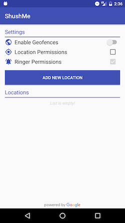

# IDENTITAS:
Nama: Ainnaya Nur Akasah

Kelas / No Urut: XIIRPL6 / 03

NIS: 4653/1372.070

Angkatan: 24

Nama Sekolah: SMK Telkom Malang

# NAMA APLIKASI
Shush Me

# LINK FILE APK:
Anda bisa mendapatkan aplikasi ini dengan cara Klik tulisan di samping -->
[Shush Me 5](https://docs.google.com/uc?export=download&id=0BxRyC99DsxNVYWQ3Tm5zaDhmaWc)

Selamat Mencoba :)

# DESKRIPSI APLIKASI:
ShushMe memungkinkan Anda memilih serangkaian lokasi yang menggunakan Google Place API, kemudian membuat geofence di sekitar tempat tersebut dan mengubah perangkat menjadi mode senyap jika Anda memasukkannya. Setelah perangkat keluar lagi, ShushMe mengubah perangkat kembali ke normal (apa pun mode dering dan volume yang Anda atur sebelum masuk)

# SCREENSHOTS

  
  
